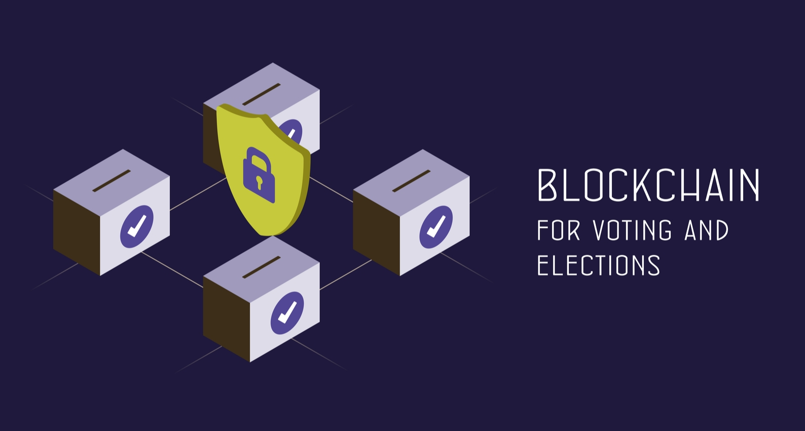
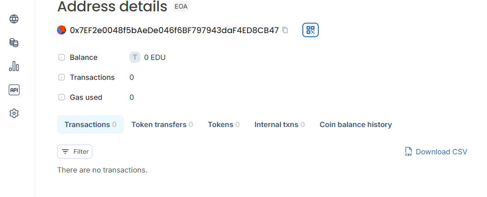

## Blockchain Voting System

## Vision

The Blockchain Voting System is a decentralized application designed to facilitate transparent, secure, and immutable voting processes. Built using Solidity and deployed on the Ethereum blockchain, this system allows for fair voting in various scenarios, from organizational elections to community polls. The smart contract ensures that only eligible voters can cast their votes and that all votes are counted accurately, with the results being visible and unalterable.

## Features

1.Voter Registration: Only the owner of the contract can register voters.
2.Vote Casting: Voters can cast their vote for a proposal if they haven't voted already.
3.Vote Counting: The system tracks the number of votes each proposal receives.
4.Result Retrieval: Provides functionality to retrieve the current leading proposal and the vote count for each proposal.

## Flowchart

1.Deploy Contract: Initialize with proposal names.
2.Register Voter: Owner registers eligible voters.
3.Vote: Eligible voters cast their votes.
4.View Results: Retrieve winning proposal and vote counts.
5.Smart Contract Address
6.Once deployed, the smart contract will be available at the following address on the Edu-Chain network:

## Contract Address: 0x7EF2e0048f5bAeDe046f6BF797943daF4ED8CB47

## Instructions
Deploy the Contract:

1.Use Remix IDE to deploy the Solidity contract to an Ethereum network.
Copy the deployed contract address.
Update Frontend:

2.Replace 'YOUR_CONTRACT_ADDRESS' with the actual deployed contract address.
Replace /* ABI from the Remix Compiler */ with the ABI JSON array generated by Remix.
Run the Frontend:

3.Open the HTML file in a web browser with Web3 capabilities (e.g., using MetaMask).
Interact with the contract using the frontend interface.

## Future Scope
1.Enhanced Voter Verification: Integrate with additional identity verification systems to ensure the authenticity of voters.
2.Multi-Candidate Voting: Extend functionality to support voting for multiple candidates in a single vote.
3.User Interface: Develop a more sophisticated frontend to interact with the contract, including features for voting and viewing results.
Contact
For any inquiries or support regarding this project, please contact:

Name: Subham Subedi
Email: subhamsubedi.1943@gmail.com
